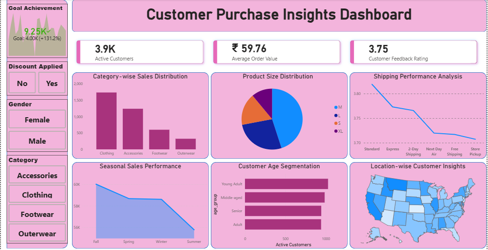

# Customer Purchase Insights Analysis

## 📊 Project Overview

This project demonstrates a complete end-to-end Data Analytics workflow, transforming raw customer shopping data into meaningful business insights.

The process began with a CSV dataset containing customer purchase information. The dataset was imported into Python for data cleaning and preprocessing, where missing values were handled using median imputation, data inconsistencies were corrected, and columns were standardized for analysis.

The cleaned dataset was then loaded into PostgreSQL for further data validation, transformation, and formatting using SQL queries. After ensuring data quality and consistency, the refined dataset was connected to Power BI for data modeling, KPI development, and interactive dashboard creation.

The final dashboard provides insights into customer demographics, purchasing behavior, product preferences, seasonal sales trends, shipping performance, customer feedback, and geographic distribution.

---

## 🔄 Project Workflow

CSV Dataset  
↓  
Python (Data Cleaning & Preprocessing)  
↓  
Missing Value Treatment (Median Imputation)  
↓  
PostgreSQL (Data Validation & Transformation)  
↓  
Power BI (Data Modeling & Visualization)  
↓  
Interactive Business Dashboard

---

## 🛠️ Tools & Technologies

- Python (Pandas, NumPy)
- PostgreSQL
- SQL
- Power BI
- Power Query
- DAX
- Microsoft Excel

---

## 📈 Dashboard Highlights

- Active Customers Analysis
- Average Order Value Tracking
- Customer Feedback Rating
- Category-wise Sales Distribution
- Product Size Distribution
- Shipping Performance Analysis
- Seasonal Sales Performance
- Customer Age Segmentation
- Location-wise Customer Insights
- Interactive Filters and Slicers

---

## 🎯 Skills Demonstrated

- Data Cleaning
- Data Transformation
- SQL Querying
- Database Management
- Data Modeling
- KPI Development
- Data Visualization
- Business Intelligence
- Analytical Problem Solving

## 📷 Dashboard Preview

